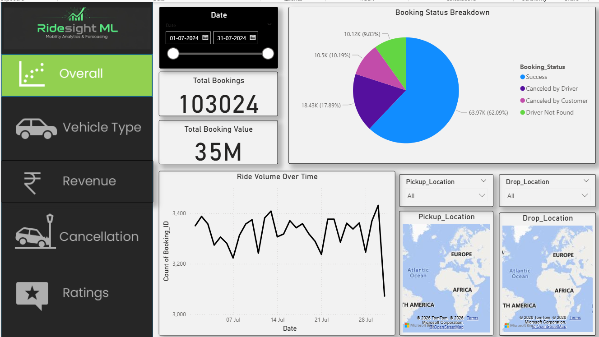
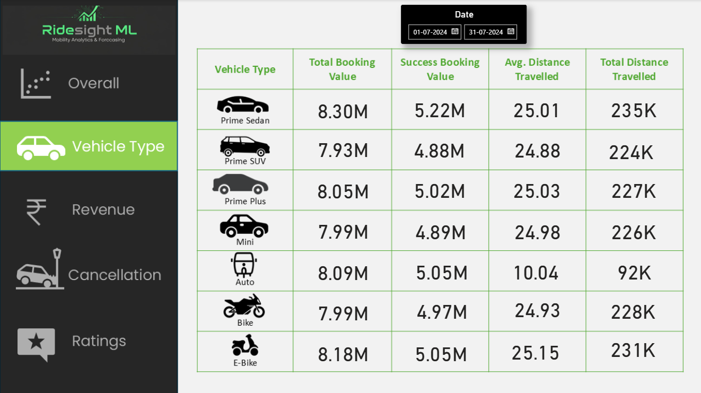
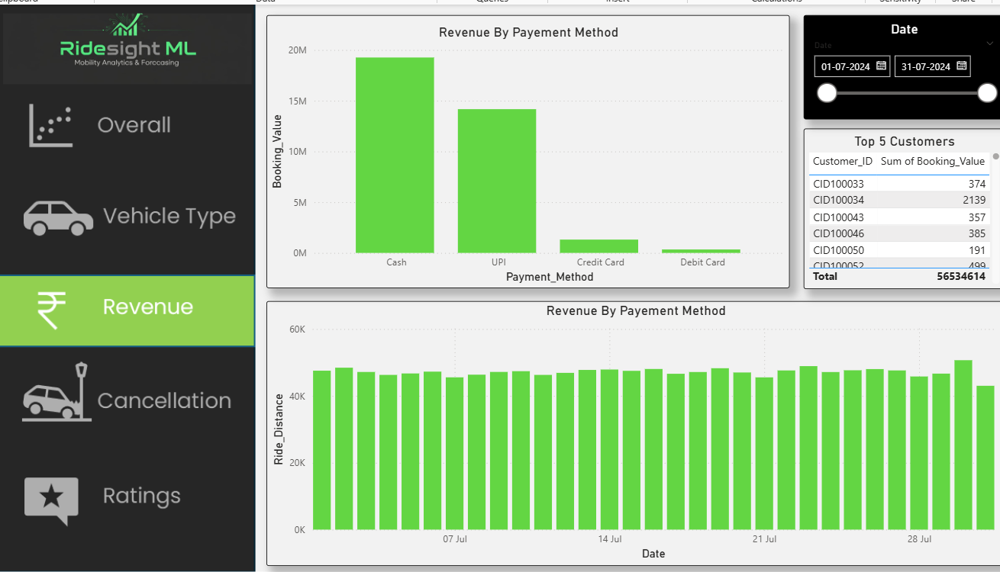
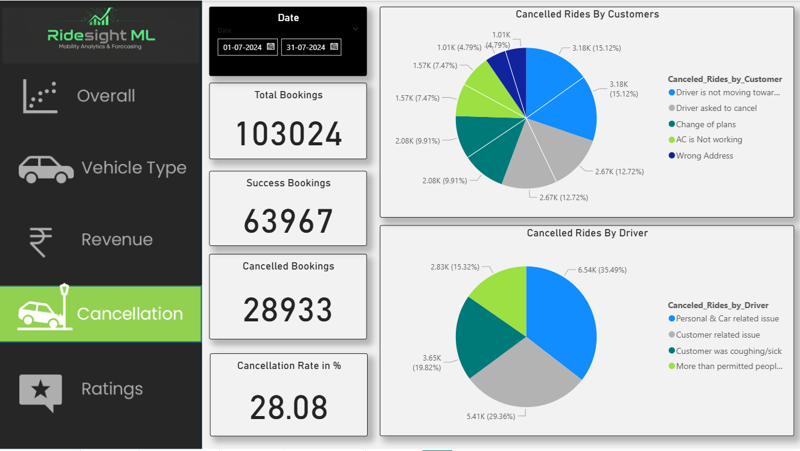
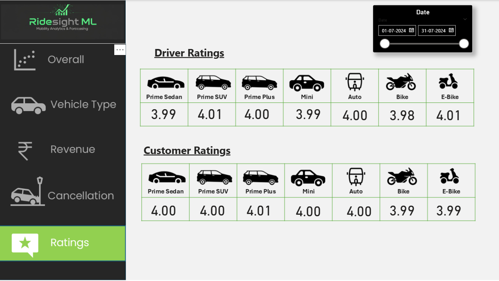
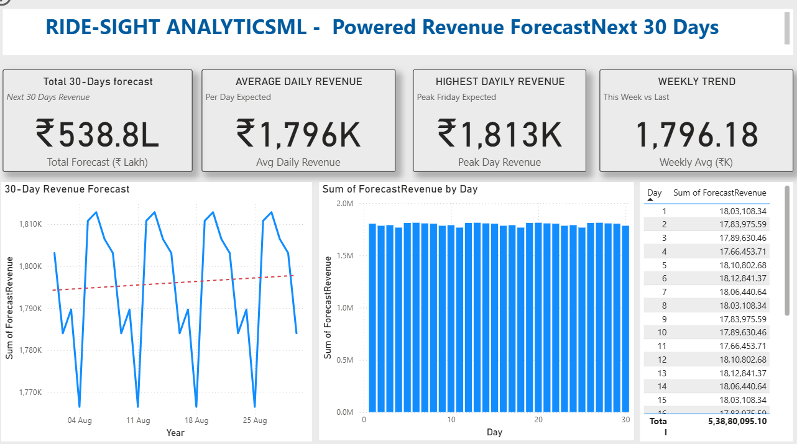
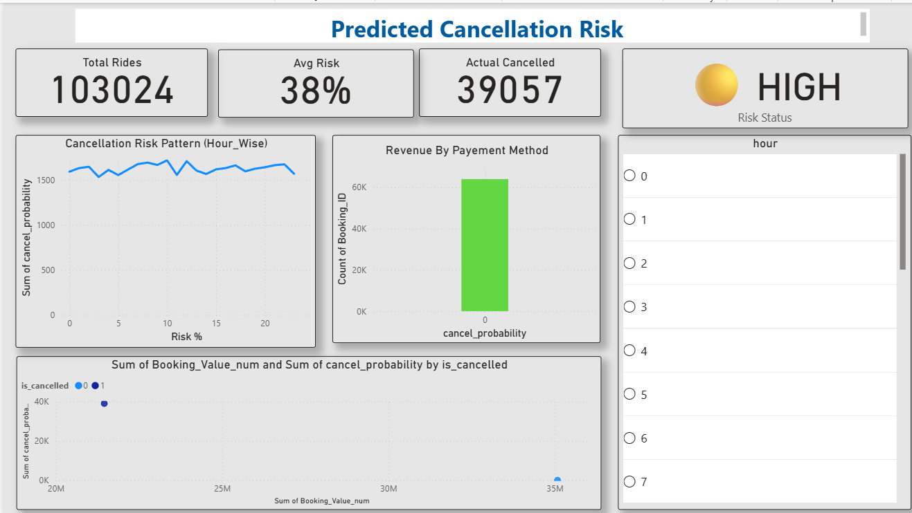

📊 RidetSight ML : Mobility Analytics & Forecasting 

This project is an interactive dashboard and machine learning system designed to analyze ride-hailing booking data and provide actionable insights into ride patterns, cancellations, and revenue forecasting.

📌 Features Included:

Overall Analysis: Total Bookings, Revenue and Key KPIs
Booking Status Breakdown: Success vs cancellations (Driver, Customer, Not Found)
Ride Trends Over Time: Daily and hourly demand patterns
Vehicle Type Analysis: Performance of different ride categories (Bike, Auto, Sedan, etc.)
Cancellation Prediction: ML-based cancel probability analysis
Revenue Forecasting: Future revenue prediction for next 30 days

🛠 Tools & Technologies Used:

Microsoft Power BI – Dashboard & Data Visualization
Microsoft Excel – Data Cleaning & Preprocessing
VS Code - Python (Pandas, NumPy, Scikit-learn) – Machine Learning Models

📈 Insights Derived:

Identified high and low demand time periods
Detected key factors influencing ride cancellations
Predicted cancellation probability for better decision-making
Forecasted future revenue trends using machine learning
Provided data-driven insights to improve operational efficiency.

🚀 Project Highlights:

End-to-end pipeline: Data → ML Model → Dashboard
Combines predictive analytics with business intelligence
Scalable and adaptable for different ride-hailing platforms

✅ Dashboard Preview:

